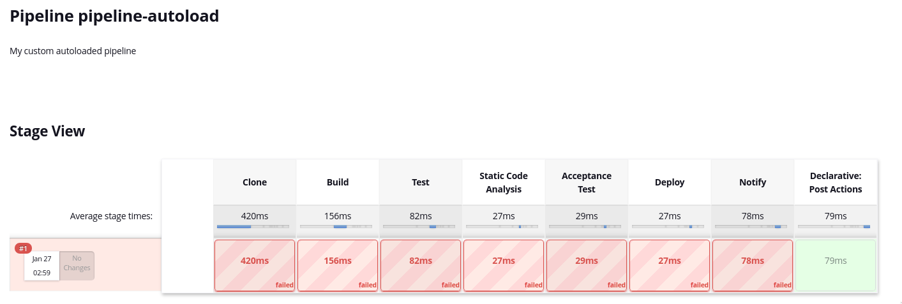

# Prueba técnica

## Builder

- Creo que tampoco entendí muy bien lo de la redundancia entre centros. Asumí que es un NFS externo a ambos clusters, y que ambos van a poder conectarse.
- El pipeline de CI es inventado en base a funciones habituales.
- Se consigue:
    - Desplegar jenkins en k8s
    - Bajo la URL indicada
    - Liveness y readiness configurados
    - Límites configurados
- Se podría optar por jenkinsX, que por lo que veo es más habitual en entornos cloud y facilita algunas cosas. Personalmente nunca he trabajado en entornos k8s y solo he usado jenkins.
- La imagen myjenkins tendría que estar en algún registro (público como docker hub, o privado como el que proporciona gitlab por ejemplo) para que kubernetes la pueda descargar. En pruebas locales con minikube se podría configurar el registro local y cambiar la `imagePullPolicy` a `Never` para que use el contenedor local (como es este caso).
- El pipeline que se autocarga va dentro del `config.xml` del job. Se proporciona el `Jenkinsfile.groovy` usado para mayor legibilidad.

## api-builder

### Dudas

- Cual es el objetivo de este componente? Actuar de proxy ante la petición a la API?
- Debe desplegar una aplicación web que sea la que haga de proxy? O lanzar simplemente un comando? El usuario que use el api-builder debe proporcionar las credenciales que usará para la petición, o solo las tendrá internamente y la petición se hace sin autenticar?

### Notas

- Se consigue usar el usuario testuser. En este caso no usé la directiva `USER` en el `Dockerfile` debido a que el usuario se cambia posteriormente a `testuser` durante la ejecución.
- Para hacer peticiones a la API de jenkins, se genera un token de forma manual para el usuario a través de la UI de jenkins.
- Se consigue:
    - Crear el Dockerfile exponiendo el puerto 8081 y bajo el usuario testuser.
    - Crear secretos con las variables necesarias.
    - Crear un deployment que lea esos secretos como variables de entorno.
- Esta parte no la he terminado. La idea era hacer que las peticiones a `/builder` fuesen redirigidas a la URL de la API de jenkins `http://builder.localhost.com/job/pipeline-autoload/build` con un POST para que así lanzasen el pipeline. De todas formas dejo el `site.conf` no funcional en el repositorio.
- Se usan los secretos de k8s montados como variables de entorno. De todas formas la seguridad no es óptima ya que simplemente están codificados en base64 y no cifrados.
- Tampoco he creado el servicio ni las demás partes de k8s que faltan.
